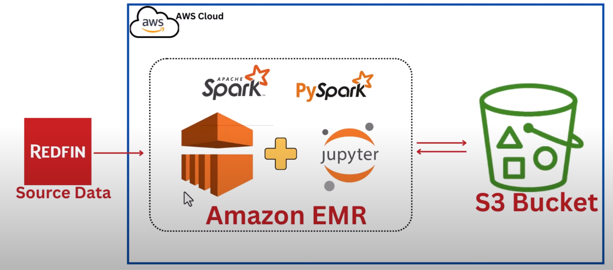

# RedfinEMR
 
## Overview
This project aims to Extract and Transform Redfin data with AWS EMR.  
I create VPC and then spin up EMR clusters within this VPC, then create Amazon EMR studio and Jupyterlab after which I attached the Jupyter notebook to the provisioned cluster.  
Then I write Pyspark code in the Jupyter notebook attached to the provisioned EMR to extract data from the Redfin data source, process it and load the transformed data as parquet file into an S3 bucket.  
## Services will be using
1. Amazon S3: Amazon S3 is an object storage service that provides manufacturing scalability, data availability, security, and performance.
2. AWS IAM: This is nothing but identity and access management which enables us to manage access to AWS services and resources securely.
3. AWS EMR: reliably and securely handling the big data use cases like machine learning, deep learning,etc.
## Dataset Used
Redfin Dataset (https://redfin-public-data.s3.us-west-2.amazonaws.com/redfin_market_tracker/city_market_tracker.tsv000.gz)

## Architecture Diagram

