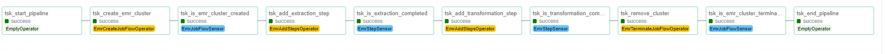
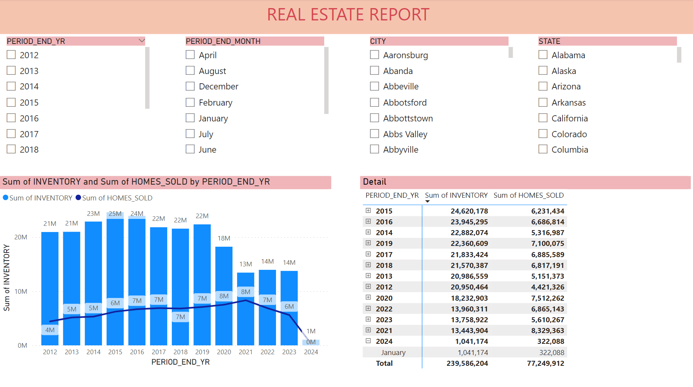

# Redfin Real Estate Analytics
 
## Overview
This project aims to extract Real Estate data from the redfin datacenter web address, then implements an ETL pipeline to convert raw data into valuable data and perform some kind of analysis.  

## Architecture Diagram

## Detail
- First, I extract the data from redfin datacenter ;then implement some ETL pipelines to convert raw data into valuable data
- Valuable Data was loaded into a snowflake data warehouse
- Finally, Connecting the snowflake data warehouse with Power BI , then doing some kind of analysis.
 
  <b>Note:</b> Airflow was used to automate EMR jobs and orchestrate the entire ETL pipeline.

## Services will be using
1. Amazon S3: Amazon S3 is an object storage service that provides manufacturing scalability, data availability, security, and performance.
2. AWS IAM: This is nothing but identity and access management which enables us to manage access to AWS services and resources securely.
3. AWS EMR: reliably and securely handling the big data use cases like machine learning, deep learning,etc.
4. Snowflake: is the engine that powers and provides access to the Data Cloud, creating a solution for data warehousing, data lakes, data engineering,etc.
## Data Used
Redfin Data Source (https://www.redfin.com/news/data-center/)

## Airflow Graph

## Analysis report (Power BI)

